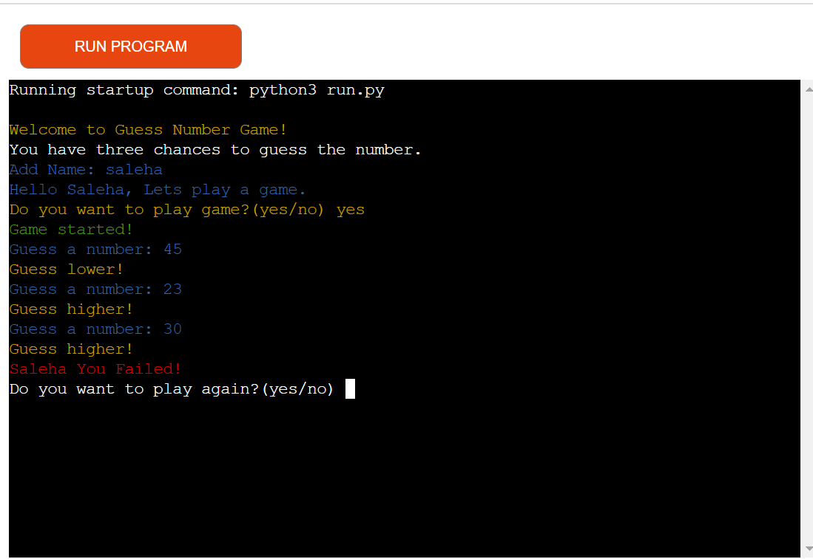
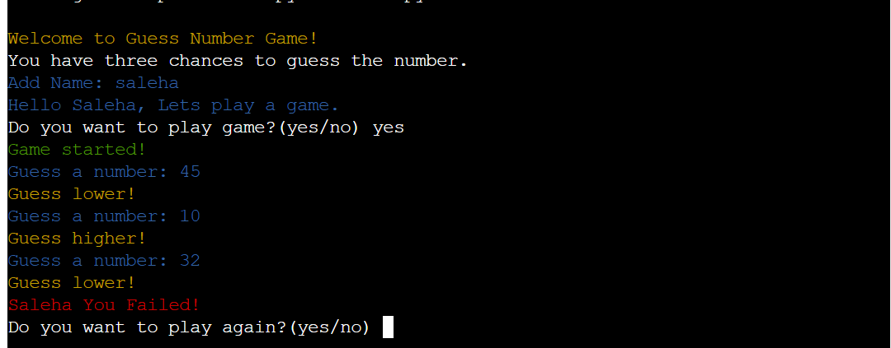
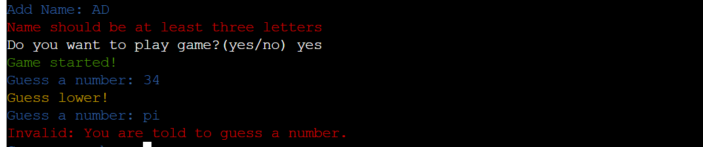
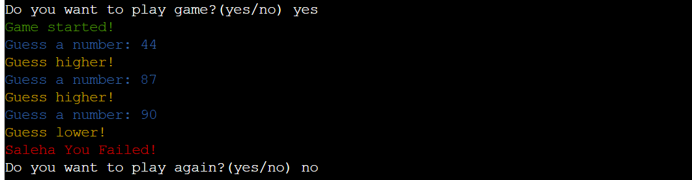
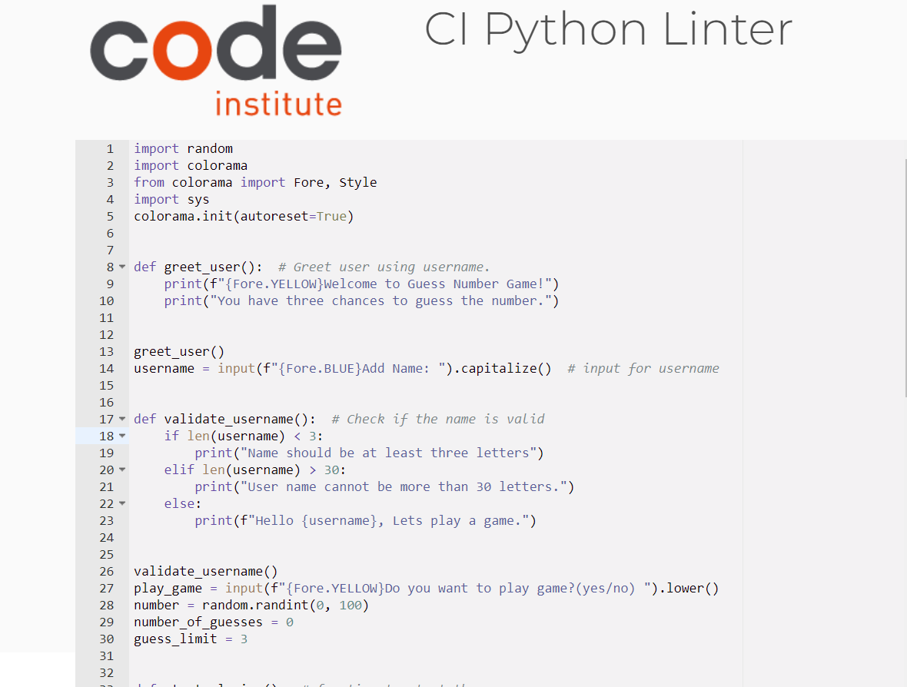

# **Guess Number Game**

This is a simple game that is created using python and run in the Terminal. The user is asked to add a name and after adding name the user decides whether to play the game or not by tying(yes/no). The user has three chances to guess the number. The user will win the game if find the number using three chances otherwise the user will lose.
 
Link to deployed project- 

## How to play

To play this game you need to add a name and after adding the name you will be asked if you want to play the game or not. If you type anything other than(yes/no). The message "Sorry I don't undrestand that." will appear.
If yes then the game starts and the user has three chances to guess the number. If the user guess is higher than the number the message "Guess lower" will help user to guess lower to find the number and if the user guess is lower the message "Guess higher" will help user to find number. The player will win this game if find the number using three chances otherwise will lose and will be asked if wanted to play again.

## Current Features

+ Accpets user input
+ Reads user input
+ Validate input
+ Rising errors

The user inputs are validated and if the user add any invalid input then the feedback is provided to let the user realize where the problem is.
In case if the user failed and wanted to play again can start the game again by typing answer yes(Do you want to play again?).

## Design

**Colours**

+ Welcome message and guess higher and lower - YELLOW

+ Game Started message - GREEN

+ Errors and failed message - RED

+ inputs - BLUE

+ Play game and play again - White

## Technologies Used

### Languages Used

+ Python

### Python Libraries Used

+ [random](https://docs.python.org/3/library/random.html) for integer number 
+ [Clorama](https://pypi.org/project/colorama/) for printing colorful texts

### Python Packages

+ Colorama Text in the terminal are shown in different colors.
+ Random returns a random integer

### Tools 

+ Gitpod - to create my file and style it before pushing to GitHub
+ Github - to create a repository and store it
+ Heroku - to connect with Github and deploy the project 
+ Sys - to exit

## Content

The content is written by author.

## Testing

After writing any code I tested it in the terminal to see if the code works as it should. Furthermore, I tested the deployed site to see if it works.

I used [pep8](https://pep8ci.herokuapp.com/) to test the codes.

## Fixed Bugs

+ I imported and installed Colorama to add color to the texts. But the text was not in a different color I returned and check my codes if I had truly imported and installed Colorama. The issue was solved by installing the Colorama (pip install Colorama). The reason was that I had closed my workspace and opened a new one instead of opening the previous one.
+  

## Deplyment

This project is deployed using [Heroku](https://www.heroku.com/github-students) and following the instruction of deployment video of Course Institue. 
These are the deployment steps:

1. Open Heroku and click on "Create New App".
2. Write your app name and select region. You should give your app a unique name.
3. On the new page click on "settings" and select Config Var, type PORT in key with a value of 8000.
4. Click "Add buildpack", select Python and click "Save Changes".
5. Select NodeJS and click save again. The order is important the Python should be on the top of NodeJS.
6.Click on "Deploy" tab.
7. Select "Github" as deployment method.
8.Search for your repository name and click connect.
9.Make sure that "main" branch is selected and click on "Enable Automatic Deploys" then, click on "Deploy Branch".
10. When your project is deployed you can open it simply by clicking "View".

## Acknowledgements

For inspiration in general and advice, I would like to thank my mentor at Code Institute(Maritna Terlevic).

